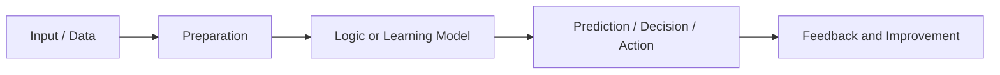
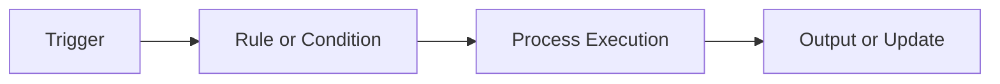
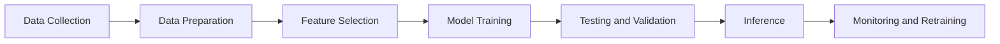
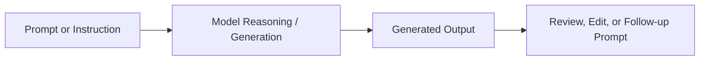
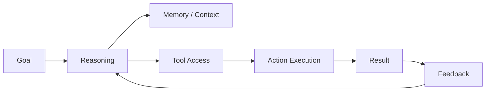
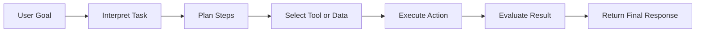
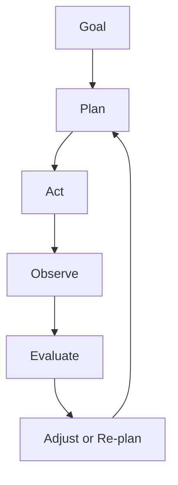
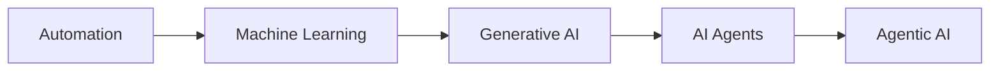
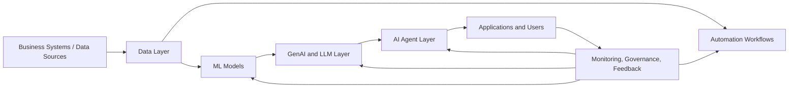

# AI Master Flow

## Understanding AI -> Automation -> Machine Learning -> Generative AI -> AI Agents -> Agentic AI

### A presentation-ready master deck for concept clarity, workflow understanding, and enterprise storytelling

---

# Purpose of This Deck

This master deck explains the full progression of modern intelligent systems in a single storyline.

It is designed to help the audience understand:

- what each concept means
- how each one works
- how each stage is different from the previous one
- where each stage is used in business and technology
- why the progression matters for modern enterprise systems

---

# Agenda

1. Understanding AI
2. Automation
3. Machine Learning
4. Generative AI
5. AI Agents
6. Agentic AI
7. Master comparison and evolution flow
8. Enterprise architecture and use cases
9. Governance, risk, and key takeaways

---

# Understanding Artificial Intelligence

Artificial Intelligence (AI) is the broad field of building systems that can perform tasks that normally require human-like intelligence.

AI systems are built to support capabilities such as:

- learning from data
- recognizing patterns
- making decisions
- understanding language
- solving problems
- generating content
- acting with limited autonomy

AI is the umbrella concept. The topics that follow in this deck are different layers or implementations within that umbrella.

---

# How AI Works

At a high level, AI systems follow a simple lifecycle:

- collect useful data or input
- process and prepare that data
- apply rules or learning models
- generate a prediction, decision, action, or content
- improve over time using feedback, retraining, or updated rules

This high-level flow is the foundation for automation, machine learning, generative AI, and agent-driven systems.

---

# Automation

Automation is the use of predefined rules and fixed logic to execute tasks without continuous human intervention.

Automation is best suited for:

- repetitive tasks
- stable workflows
- rule-based approvals
- scheduled execution
- deterministic business processes

Common examples include:

- RPA steps
- ETL jobs
- invoice routing
- CI/CD pipelines
- ticket assignment workflows

Automation is efficient, predictable, and auditable, but it does not learn from data on its own.

---

# Automation Workflow

Automation follows explicit rules from trigger to output.

### Key idea

If the rule is known in advance, automation can execute it reliably.

### Limitation

If the situation changes outside the programmed rules, the automation does not adapt unless a human updates the workflow.

---

# Automation vs AI

| Area | Automation | AI |
| --- | --- | --- |
| Core behavior | Follows fixed rules | Can learn, infer, or adapt |
| Decision logic | Predefined | Data-driven or model-driven |
| Flexibility | Low | Higher |
| Best use | Repetitive tasks | Complex or variable tasks |
| Example | Scheduled report run | Intelligent recommendation engine |

### Practical takeaway

Automation is excellent for repeatable execution.
AI becomes valuable when the system must interpret, predict, reason, or adapt.

---

# Machine Learning

Machine Learning (ML) is a subset of AI that enables systems to learn patterns from data instead of relying only on fixed, hard-coded rules.

Machine learning is useful when:

- the data contains patterns that are hard to describe manually
- the problem changes over time
- predictions are needed at scale
- the outcome depends on probability rather than fixed logic

Typical ML outcomes include:

- classification
- prediction
- scoring
- recommendation
- anomaly detection

---

# How Machine Learning Works

Machine learning uses data to train a model, validate performance, and then apply that model to new data.

### Key idea

The model improves by learning patterns from historical or example data.

### Difference from automation

Automation follows rules. ML learns patterns.

---

# Main Types of Machine Learning

### Supervised Learning
Uses labeled data to predict known outcomes.

### Unsupervised Learning
Uses unlabeled data to discover hidden patterns or clusters.

### Semi-Supervised Learning
Uses a small labeled set plus a larger unlabeled set.

### Reinforcement Learning
Learns through actions, rewards, and penalties.

### Common use areas

- fraud detection
- forecasting
- recommendation systems
- clustering and segmentation
- robotics and adaptive control

---

# Generative AI

Generative AI is the branch of AI that creates new content in response to a prompt, instruction, or context.

It can generate:

- text
- images
- code
- audio
- video
- summaries
- structured outputs

Generative AI is powered by advanced model families such as:

- large language models (LLMs)
- transformers
- diffusion models
- multimodal models

It is different from predictive ML because the goal is not only to classify or predict - it is to create new output.

---

# How Generative AI Works

Generative AI takes a prompt, interprets context, and produces new output based on learned patterns from its training data.

### Examples

- answer generation
- code completion
- content drafting
- image creation
- knowledge summarization

### Limitation

Generated output can be useful and fast, but it may still be inaccurate, incomplete, or hallucinated without guardrails.

---

# Generative AI vs Machine Learning

| Area | Traditional ML | Generative AI |
| --- | --- | --- |
| Main purpose | Predict or classify | Create new output |
| Typical output | Score, label, forecast | Text, image, code, media |
| Input style | Structured data | Prompt, context, documents |
| Example | Churn prediction | Drafting a proposal |

### Practical takeaway

Traditional ML helps answer: "What is likely to happen?"
Generative AI helps answer: "What can be created or drafted next?"

---

# AI Agents

An AI agent is a system that can take a goal, reason about what needs to be done, use tools, and perform actions to complete a task.

An AI agent goes beyond simple response generation.
It can:

- choose a next step
- call an API or tool
- retrieve information
- perform multi-step work
- maintain context
- return a result after execution

In simple terms:

**Generative AI answers.**
**AI agents can answer and act.**

---

# Core Components of an AI Agent

A practical AI agent is usually made up of these building blocks:

- **Goal:** the task or objective to complete
- **Reasoning layer:** decides what to do next
- **Memory or context:** keeps relevant state or prior information
- **Tools:** APIs, databases, search, business systems
- **Execution layer:** performs actions
- **Feedback loop:** checks results and adjusts

---

# How an AI Agent Works

The agent workflow is a goal-driven execution cycle.

### Common examples

- checking a database and summarizing findings
- opening a ticket and updating a status
- collecting data from multiple APIs and generating a report
- performing multi-step troubleshooting

---

# Types of AI Agents

AI agents can be organized by how they make decisions.

### Simple reflex agent
Acts on direct conditions and fixed responses.

### Model-based reflex agent
Uses an internal model of the environment to make better decisions.

### Goal-based agent
Chooses actions based on a desired objective.

### Utility-based agent
Chooses actions by comparing possible outcomes and selecting the most valuable one.

### Learning agent
Improves behavior over time from feedback or new experience.

This progression moves from simple reaction to more adaptive and intelligent behavior.

---

# Agentic AI

Agentic AI is a more advanced, goal-driven AI approach in which one or more agents can plan, act, observe outcomes, and adjust their strategy with limited human supervision.

Agentic AI is not just a chatbot and not just a single agent call.
It focuses on:

- decomposition of complex goals
- multi-step execution
- self-correction
- tool coordination
- adaptive planning
- ongoing decision loops

It is the closest stage in this deck to autonomous workflow intelligence.

---

# How Agentic AI Works

Agentic AI uses a repeated loop of planning, execution, observation, and correction.

### Key difference from a basic AI agent

A basic agent may complete a task.
An agentic system can keep refining its approach until the broader goal is achieved.

---

# AI Agents vs Agentic AI

| Area | AI Agents | Agentic AI |
| --- | --- | --- |
| Scope | Usually a single task or workflow | Broader goal execution |
| Planning depth | Limited to task steps | Multi-step and adaptive |
| Autonomy | Moderate | Higher |
| Feedback use | Can use feedback | Continuously re-plans from feedback |
| Example | Fetch and summarize data | Investigate issue, decide actions, and escalate if needed |

### Practical takeaway

AI agents are the building blocks.
Agentic AI is the larger, more autonomous orchestration of those capabilities.

---

# Master Evolution Flow

This is the full capability progression your boss is pointing to.

### How to read this flow

- **Automation** executes fixed rules
- **ML** learns from data
- **Generative AI** creates new output
- **AI Agents** reason and act using tools
- **Agentic AI** manages broader autonomous workflows

---

# Enterprise Reference Architecture

This slide shows how these capabilities can fit together in a real enterprise environment.

### Interpretation

- automation runs stable processes
- ML adds prediction and scoring
- generative AI adds content and reasoning output
- agents add actions and tool usage
- monitoring and governance remain essential at every layer

---

# Business Use Cases by Capability

### Automation

- invoice routing
- scheduled reporting
- ETL and batch jobs

### Machine Learning

- fraud detection
- churn prediction
- demand forecasting

### Generative AI

- chat assistants
- proposal drafting
- code support

### AI Agents

- autonomous research assistant
- ticket triage and resolution support
- IT workflow execution

### Agentic AI

- multi-step investigation systems
- self-healing operations
- coordinated multi-agent business processes

---

# Governance and Risk

As systems become more autonomous, governance becomes more important.

Key risks include:

- bad or biased data
- incorrect predictions
- hallucinated generated content
- unsafe actions from tool-connected agents
- privacy and access-control issues
- compliance failures
- missing monitoring or audit trails

### Core controls

- human review for high-risk actions
- approval gates
- access boundaries
- testing and validation
- monitoring and audit logging

---

# When to Use What

### Use Automation when:

- the rule is stable
- the process is repetitive
- deterministic execution matters most

### Use Machine Learning when:

- you need prediction, scoring, or pattern detection
- the logic is hard to write manually

### Use Generative AI when:

- you need content creation, summarization, or conversational output

### Use AI Agents when:

- the system must use tools and complete multi-step tasks

### Use Agentic AI when:

- the goal is broad, adaptive, and may require repeated planning and correction

---

# Key Takeaways

- AI is the broad umbrella for intelligent systems.
- Automation handles fixed rules and repeatable execution.
- Machine Learning learns from data and improves predictions.
- Generative AI creates new content from prompts and context.
- AI Agents combine reasoning, memory, and tools to perform actions.
- Agentic AI extends this into more autonomous, goal-driven workflows.
- The higher the autonomy, the higher the need for governance, monitoring, and human oversight.