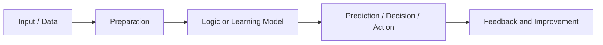

# Understanding Artificial Intelligence

Artificial Intelligence (AI) is the broad field of building systems that can perform tasks that normally require human-like intelligence.

AI systems are built to support capabilities such as:

- learning from data
- recognizing patterns
- making decisions
- understanding language
- solving problems
- generating content
- acting with limited autonomy

AI is the umbrella concept. The topics that follow in this deck are different layers or implementations within that umbrella.

---

# How AI Works

At a high level, AI systems follow a simple lifecycle:

- collect useful data or input
- process and prepare that data
- apply rules or learning models
- generate a prediction, decision, action, or content
- improve over time using feedback, retraining, or updated rules

This high-level flow is the foundation for automation, machine learning, generative AI, and agent-driven systems.
