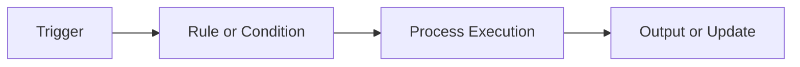

# Automation

Automation is the use of predefined rules and fixed logic to execute tasks without continuous human intervention.

Automation is best suited for:

- repetitive tasks
- stable workflows
- rule-based approvals
- scheduled execution
- deterministic business processes

Common examples include:

- RPA steps
- ETL jobs
- invoice routing
- CI/CD pipelines
- ticket assignment workflows

Automation is efficient, predictable, and auditable, but it does not learn from data on its own.

---

# Automation Workflow

Automation follows explicit rules from trigger to output.

### Key idea

If the rule is known in advance, automation can execute it reliably.

### Limitation

If the situation changes outside the programmed rules, the automation does not adapt unless a human updates the workflow.

---

# Automation vs AI

| Area | Automation | AI |
| --- | --- | --- |
| Core behavior | Follows fixed rules | Can learn, infer, or adapt |
| Decision logic | Predefined | Data-driven or model-driven |
| Flexibility | Low | Higher |
| Best use | Repetitive tasks | Complex or variable tasks |
| Example | Scheduled report run | Intelligent recommendation engine |

### Practical takeaway

Automation is excellent for repeatable execution.   
AI becomes valuable when the system must interpret, predict, reason, or adapt.