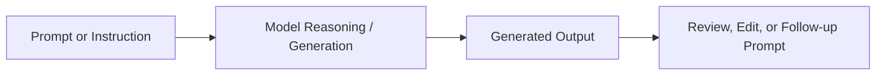

# Generative AI

Generative AI is the branch of AI that creates new content in response to a prompt, instruction, or context.

It can generate:

- text
- images
- code
- audio
- video
- summaries
- structured outputs

Generative AI is powered by advanced model families such as:

- large language models (LLMs)
- transformers
- diffusion models
- multimodal models

It is different from predictive ML because the goal is not only to classify or predict - it is to create new output.

---

# How Generative AI Works

Generative AI takes a prompt, interprets context, and produces new output based on learned patterns from its training data.

### Examples

- answer generation
- code completion
- content drafting
- image creation
- knowledge summarization

### Limitation

Generated output can be useful and fast, but it may still be inaccurate, incomplete, or hallucinated without guardrails.

---

# Generative AI vs Machine Learning

| Area | Traditional ML | Generative AI |
| --- | --- | --- |
| Main purpose | Predict or classify | Create new output |
| Typical output | Score, label, forecast | Text, image, code, media |
| Input style | Structured data | Prompt, context, documents |
| Example | Churn prediction | Drafting a proposal |

### Practical takeaway

Traditional ML helps answer: "What is likely to happen?"
Generative AI helps answer: "What can be created or drafted next?"

---