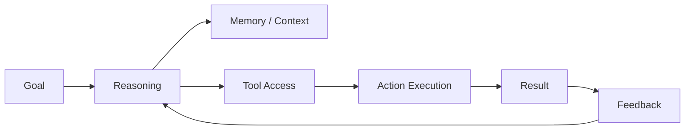
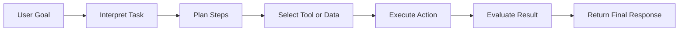

# AI Agents

An AI agent is a system that can take a goal, reason about what needs to be done, use tools, and perform actions to complete a task.

An AI agent goes beyond simple response generation.
It can:

- choose a next step
- call an API or tool
- retrieve information
- perform multi-step work
- maintain context
- return a result after execution

In simple terms:

**Generative AI answers.**
**AI agents can answer and act.**

---

# Core Components of an AI Agent

A practical AI agent is usually made up of these building blocks:

- **Goal:** the task or objective to complete
- **Reasoning layer:** decides what to do next
- **Memory or context:** keeps relevant state or prior information
- **Tools:** APIs, databases, search, business systems
- **Execution layer:** performs actions
- **Feedback loop:** checks results and adjusts

---

# How an AI Agent Works

The agent workflow is a goal-driven execution cycle.

### Common examples

- checking a database and summarizing findings
- opening a ticket and updating a status
- collecting data from multiple APIs and generating a report
- performing multi-step troubleshooting

---

# Types of AI Agents

AI agents can be organized by how they make decisions.

### Simple reflex agent
Acts on direct conditions and fixed responses.

### Model-based reflex agent
Uses an internal model of the environment to make better decisions.

### Goal-based agent
Chooses actions based on a desired objective.

### Utility-based agent
Chooses actions by comparing possible outcomes and selecting the most valuable one.

### Learning agent
Improves behavior over time from feedback or new experience.

This progression moves from simple reaction to more adaptive and intelligent behavior.

---
