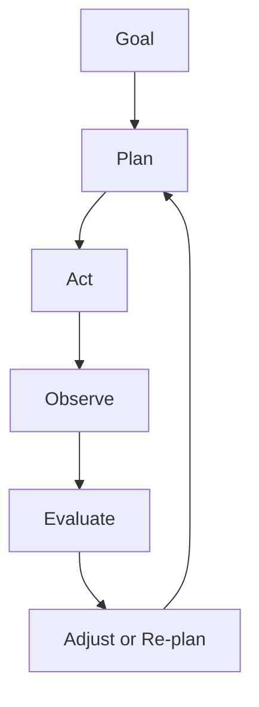
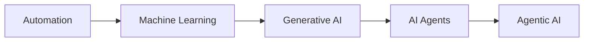
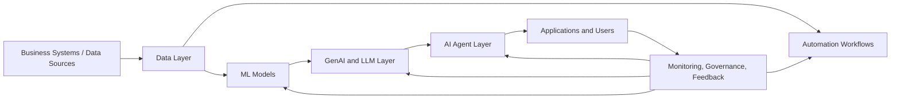

# Agentic AI

Agentic AI is a more advanced, goal-driven AI approach in which one or more agents can plan, act, observe outcomes, and adjust their strategy with limited human supervision.

Agentic AI is not just a chatbot and not just a single agent call.
It focuses on:

- decomposition of complex goals
- multi-step execution
- self-correction
- tool coordination
- adaptive planning
- ongoing decision loops

It is the closest stage in this deck to autonomous workflow intelligence.

---

# How Agentic AI Works

Agentic AI uses a repeated loop of planning, execution, observation, and correction.

### Key difference from a basic AI agent

A basic agent may complete a task.
An agentic system can keep refining its approach until the broader goal is achieved.

---

# AI Agents vs Agentic AI

| Area | AI Agents | Agentic AI |
| --- | --- | --- |
| Scope | Usually a single task or workflow | Broader goal execution |
| Planning depth | Limited to task steps | Multi-step and adaptive |
| Autonomy | Moderate | Higher |
| Feedback use | Can use feedback | Continuously re-plans from feedback |
| Example | Fetch and summarize data | Investigate issue, decide actions, and escalate if needed |

### Practical takeaway

AI agents are the building blocks.
Agentic AI is the larger, more autonomous orchestration of those capabilities.

---

# Master Evolution Flow

This is the full capability progression your boss is pointing to.

### How to read this flow

- **Automation** executes fixed rules
- **ML** learns from data
- **Generative AI** creates new output
- **AI Agents** reason and act using tools
- **Agentic AI** manages broader autonomous workflows

---

# Enterprise Reference Architecture

This slide shows how these capabilities can fit together in a real enterprise environment.

### Interpretation

- automation runs stable processes
- ML adds prediction and scoring
- generative AI adds content and reasoning output
- agents add actions and tool usage
- monitoring and governance remain essential at every layer

---

# Business Use Cases by Capability

### Automation

- invoice routing
- scheduled reporting
- ETL and batch jobs

### Machine Learning

- fraud detection
- churn prediction
- demand forecasting

### Generative AI

- chat assistants
- proposal drafting
- code support

### AI Agents

- autonomous research assistant
- ticket triage and resolution support
- IT workflow execution

### Agentic AI

- multi-step investigation systems
- self-healing operations
- coordinated multi-agent business processes

---

# Governance and Risk

As systems become more autonomous, governance becomes more important.

Key risks include:

- bad or biased data
- incorrect predictions
- hallucinated generated content
- unsafe actions from tool-connected agents
- privacy and access-control issues
- compliance failures
- missing monitoring or audit trails

### Core controls

- human review for high-risk actions
- approval gates
- access boundaries
- testing and validation
- monitoring and audit logging

---

# When to Use What

### Use Automation when:

- the rule is stable
- the process is repetitive
- deterministic execution matters most

### Use Machine Learning when:

- you need prediction, scoring, or pattern detection
- the logic is hard to write manually

### Use Generative AI when:

- you need content creation, summarization, or conversational output

### Use AI Agents when:

- the system must use tools and complete multi-step tasks

### Use Agentic AI when:

- the goal is broad, adaptive, and may require repeated planning and correction
