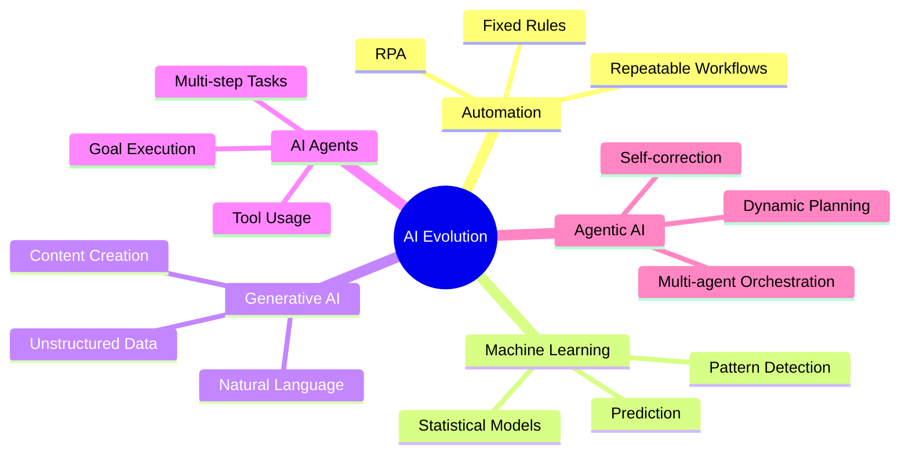
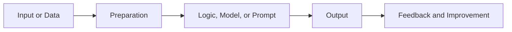
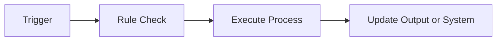
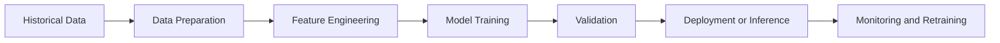
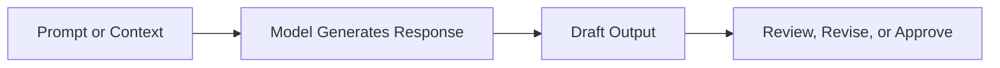
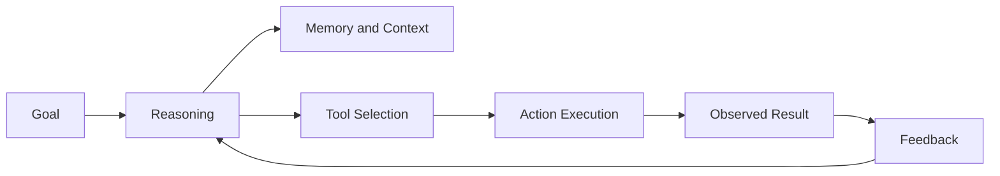
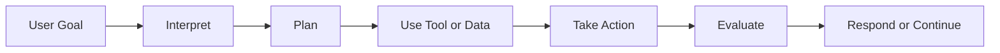
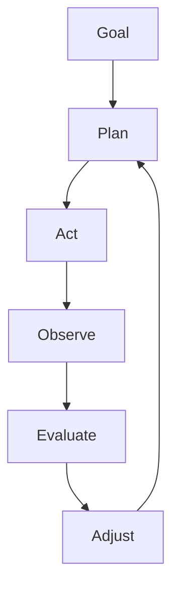
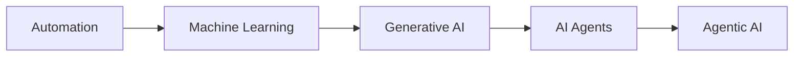
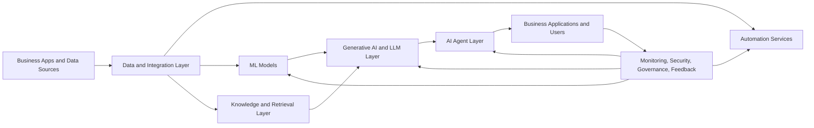

# 🧠 AI Master Flow
> Venkata Bhattaram / TINITIATE.COM

## 🛤️ Evolution: Automation → Machine Learning → Generative AI → AI Agents → Agentic AI

### A presentation-ready master deck for large audiences with mixed business and technical backgrounds

---

# 🎯 Purpose of This Deck

This deck explains the progression of modern intelligent systems in one simple storyline, from fixed-rule automation to more autonomous agentic systems.

It is designed for audiences with different levels of IT knowledge, including:

- 👔 Business leaders who need strategy, value, and risk clarity
- 🧑‍💼 Operations teams who need practical examples
- 🧑‍💻 Technical teams who need architectural understanding
- 🧑‍🏫 New learners who need plain-English explanations before deep technical detail

By the end, the audience should understand:

- 📘 What each term means
- ⚙️ How each capability works at a high level
- 🔄 How one stage evolves into the next
- 🏢 Where each capability fits in the enterprise
- 🛡️ Why governance becomes more important as autonomy increases

---

# 👥 How to Use This Deck for a Large Group

For mixed audiences, present each topic in three layers:

1. 🟢 Plain English: What it means in simple language
2. 🔵 Operational View: What it does in a real process
3. 🟣 Technical View: What powers it behind the scenes

Presenter tip:

- Use the simple explanation first
- Use the workflow diagram second
- Use the enterprise example last
- Pause after each major section for questions from non-technical attendees

---

# 🗂️ Agenda

## 🏗️ Phase 1: Foundations
1. 🌍 The Big Picture: AI Evolution
2. 🤖 What AI Actually Means
3. ⚙️ Automation: The Starting Point

## 🧠 Phase 2: The Cognitive Shift
4. 📊 Machine Learning: Predicting
5. 🎨 Generative AI: Creating

## 🛠️ Phase 3: The Autonomous Shift
6. 🛠️ AI Agents: Reasoning and Acting
7. 🎼 Agentic AI: Coordinating and Adapting

## 🏢 Phase 4: Enterprise Adoption
8. 🏛️ Enterprise Reference Architecture
9. 💼 Industry and Department Use Cases
10. 🛡️ Governance, Risk, and Controls
11. 🚦 When to Use What
12. 🔑 Final Takeaways

---

# 🌍 The Big Picture: AI Evolution Flow

### Plain English

The journey moves from systems that simply follow instructions to systems that can analyze, create, act, and eventually coordinate more complex work with less human direction.

### Simple mental model

- ⚙️ Automation does
- 📊 Machine Learning predicts
- 🎨 Generative AI creates
- 🛠️ AI Agents act
- 🎼 Agentic AI orchestrates

---

# 🤖 What Is Artificial Intelligence?

Artificial Intelligence is the broad field of building systems that perform tasks that usually require human judgment, pattern recognition, language handling, or decision support.

### In plain English

AI is the umbrella term.
Everything else in this deck sits somewhere under that umbrella.

### Common capabilities of AI

- 📚 Learning from data
- 🔍 Finding patterns humans may miss
- 🗣️ Understanding and generating language
- 🧩 Solving problems under constraints
- 🎨 Creating new content
- 🧭 Recommending or choosing next steps

### Important audience note

Not all AI is autonomous.
Many AI systems only assist humans.
Only later stages in this deck start taking actions with limited supervision.

---

# ⚙️ How Intelligent Systems Work

Most intelligent systems, simple or advanced, follow the same broad lifecycle:

### What this means

- 📥 Input: Data, documents, events, or prompts enter the system
- 🧹 Preparation: Data is cleaned, formatted, or enriched
- 🧠 Processing: Rules, models, or language models generate an outcome
- 📤 Output: The system returns a prediction, answer, action, or artifact
- 🔁 Feedback: Humans or systems evaluate results and improve future performance

### Why this matters

This same pattern appears in automation, ML, GenAI, agents, and agentic AI.
The main difference is the sophistication of the processing and the level of autonomy.

---

# ⚙️ Automation

Automation is the use of predefined rules and fixed logic to complete tasks without continuous human effort.

### Plain English

If the rule is already known, automation can execute it quickly and consistently.

### Best fit

- 🔁 Repetitive tasks
- 📏 Stable and well-defined processes
- ⏰ Scheduled jobs
- ✅ Approval rules with clear thresholds
- 📋 Processes that need consistency and auditability

### Common examples

- 🤖 RPA bots entering data into legacy systems
- 🗃️ ETL jobs moving data between systems
- 🧾 Invoice routing by supplier or cost center
- 🚀 CI/CD pipelines for software releases
- 🎫 Helpdesk ticket assignment by category

### Strengths

- Fast
- Predictable
- Easy to audit
- Low ambiguity

### Limitation

Automation does not learn by itself.
If the process changes, a human must update the rules.

---

# 🔄 Automation Workflow

### Example

If an invoice is under $5,000, route it to manager approval.
If it is above $5,000, route it to finance director approval.

### Key message for non-technical audiences

Automation is excellent when the path is known in advance.
It struggles when judgment, interpretation, or flexibility are required.

---

# ⚖️ Automation vs AI

| Area | Automation | AI |
| --- | --- | --- |
| Core behavior | Follows fixed instructions | Learns, predicts, generates, or adapts |
| Logic type | Predefined rules | Model-driven or data-driven |
| Flexibility | Low | Medium to high |
| Best for | Stable repeatable tasks | Variable or judgment-heavy tasks |
| Typical output | Completed routine step | Prediction, answer, recommendation, or action |

### Quick takeaway

Automation is not "less valuable" than AI.
It is often the right answer for stable processes.
AI becomes useful when the process is less predictable.

---

# 🧠 Phase 2: The Cognitive Shift

This phase introduces systems that no longer rely only on fixed instructions.
They either learn from data or generate new output from context.

---

# 📊 Machine Learning (ML)

Machine Learning is a subset of AI where systems learn patterns from data instead of relying only on hard-coded rules.

### Plain English

Instead of telling the system every rule, you give it examples and let it learn the pattern.

### ML is useful when

- 🧩 The pattern is too complex to write as a rule
- 📈 You need predictions at scale
- 🌍 Behavior changes over time
- 🎯 You need probability, scoring, or ranking

### Typical outcomes

- 🗂️ Classification: spam vs non-spam
- 🔮 Prediction: next month sales forecast
- 💯 Scoring: credit or fraud risk score
- 🛒 Recommendation: next-best product or offer
- 🚨 Anomaly detection: unusual transactions or system behavior

---

# 🛠️ How Machine Learning Works

### Simple explanation

The model studies historical examples, finds patterns, and applies those patterns to new data.

### Important note for large-group teaching

ML does not "understand" the world like a human.
It finds statistical relationships that can be very powerful, but also imperfect.

---

# 🧪 Main Types of Machine Learning

## 🎯 Supervised Learning
Uses labeled examples.
Example: train on past approved and rejected loans to predict future approvals.

## 🕵️ Unsupervised Learning
Uses unlabeled data to discover hidden structure.
Example: group customers into behavior-based segments.

## ⚖️ Semi-Supervised Learning
Combines a small set of labeled data with a large set of unlabeled data.
Useful when labeling is expensive.

## 🎮 Reinforcement Learning
Learns through actions, rewards, and penalties.
Useful for robotics, optimization, and sequential decision-making.

### Business-friendly summary

Machine learning is best when you want better prediction, better pattern detection, or better decision support.

---

# 🎨 Generative AI

Generative AI creates new content based on prompts, instructions, examples, or retrieved context.

### Plain English

If ML predicts an answer, Generative AI composes an answer.

### It can generate

- 📝 Text
- 🖼️ Images
- 💻 Code
- 🎵 Audio
- 🎥 Video
- 📄 Summaries
- 🧾 Structured outputs like tables or JSON

### Common enterprise uses

- Drafting emails, reports, and proposals
- Summarizing long documents
- Turning knowledge bases into conversational assistants
- Helping developers write code faster
- Generating first drafts for marketing and operations

---

# ⚙️ How Generative AI Works

### What makes it powerful

- It works well with unstructured data like documents, emails, and chats
- It can respond in natural language
- It can reduce time spent on first-draft creation

### What makes it risky

- It can sound confident and still be wrong
- It may miss context if grounded data is not provided
- It needs human review for sensitive or high-stakes use cases

### Helpful enterprise concept

RAG, or Retrieval-Augmented Generation, improves accuracy by giving the model trusted documents or knowledge at runtime.

---

# ⚖️ Traditional ML vs Generative AI

| Area | Traditional ML | Generative AI |
| --- | --- | --- |
| Main job | Predict or classify | Create or transform content |
| Typical input | Structured data | Prompts, documents, context |
| Typical output | Score, label, forecast | Text, image, code, summary |
| Best question | What is likely? | What should be drafted? |
| Example | Churn prediction | Proposal drafting |

### Simple distinction

- 📊 ML answers: "What is likely to happen?"
- 🎨 GenAI answers: "What can we create next?"

---

# 🛠️ AI Agents

An AI agent is a system that receives a goal, reasons through steps, uses tools, and takes actions to complete work.

### Plain English

Generative AI can answer questions.
AI agents can answer questions and do something about them.

### Typical capabilities

- 🤔 Interpret a task
- 🧭 Plan next steps
- 🔧 Use tools and APIs
- 📚 Retrieve live or enterprise data
- 🔄 Perform multi-step workflows
- ✅ Return a completed outcome

### Simple examples

- Check an order system and summarize delayed shipments
- Look up customer history and prepare a support response
- Open a ticket, update status, and notify the right team
- Run a troubleshooting script and summarize findings

---

# 🧩 Core Components of an AI Agent

- 🎯 Goal: the objective the agent is trying to achieve
- 🧠 Reasoning layer: usually an LLM deciding what to do next
- 💾 Memory: session context and sometimes long-term stored knowledge
- 🧰 Tools: APIs, databases, search, internal apps, files
- ⚡ Execution layer: the code that performs the action
- 🔁 Feedback loop: checks whether the last step worked

### Audience-friendly explanation

Think of an agent like a digital worker with:

- a goal
- a brain
- a toolbox
- a way to check its own progress

---

# 🔄 How an AI Agent Works

### Key difference from basic GenAI

A chatbot may stop after producing text.
An agent can keep going by calling systems and completing steps.

### Real-world examples

- Service desk triage agent
- Procurement follow-up agent
- Sales assistant agent
- Finance reconciliation helper
- IT remediation assistant

---

# 🧭 Types of AI Agents

## ⚡ Reflex agent
Acts on simple conditions.

## 🗺️ Model-based agent
Uses an internal representation of the environment.

## 🎯 Goal-based agent
Chooses actions based on a desired outcome.

## ⚖️ Utility-based agent
Chooses the most valuable path among options.

## 🎓 Learning agent
Improves over time using feedback.

### Why this matters

This shows that not every agent is highly autonomous.
Some are simple helpers, while others are much more adaptive.

---

# 🎼 Agentic AI

Agentic AI is a more advanced operating model in which one or more agents can plan, act, observe, re-plan, and collaborate over time toward a broader goal.

### Plain English

If an AI agent is a skilled worker, agentic AI is a managed team working toward an objective.

### Typical characteristics

- 🧩 Breaks large goals into smaller tasks
- 🔄 Runs multi-step and long-running processes
- 🛡️ Checks for failure and tries alternatives
- 🤝 Coordinates specialized agents
- 🗺️ Adapts the plan when conditions change
- ⏱️ Works across longer time horizons

### Examples

- Investigate a production issue, collect logs, test fixes, and escalate if needed
- Review a contract package, gather missing information, draft responses, and route for legal review
- Coordinate demand planning, inventory checks, and logistics changes during disruption

---

# ⚙️ How Agentic AI Works

### Why this is different

A basic agent often completes one workflow.
An agentic system keeps evaluating progress against a larger mission and changes strategy when needed.

### Caution

This added autonomy creates more value, but also more risk.
That is why governance, permissions, logging, and human checkpoints become critical.

---

# ⚖️ AI Agents vs Agentic AI

| Area | AI Agents | Agentic AI |
| --- | --- | --- |
| Scope | One task or workflow | Broader goal or mission |
| Planning depth | Short to medium | Deep and adaptive |
| Autonomy | Moderate | Higher |
| Collaboration | Often single agent | Often multiple specialized agents |
| Example | Summarize and send a report | Investigate, decide, route, follow up, and learn |

### Practical takeaway

AI agents are the workers.
Agentic AI is the orchestration model that coordinates workers toward a bigger outcome.

---

# 🏢 Phase 4: Enterprise Adoption

This phase explains how organizations should think about deployment, value, operating models, and risk.

---

# 🌊 Master Capability Flow

### How to read this progression

- ⚙️ Automation improves execution efficiency
- 📊 ML improves prediction and decision support
- 🎨 GenAI improves content and communication
- 🛠️ Agents improve action and workflow completion
- 🎼 Agentic AI improves autonomy across broader goals

### Important enterprise message

These stages are additive, not replacement-only.
Most enterprises will use all five at the same time.

---

# 🏛️ Enterprise Reference Architecture

### Architecture interpretation

- 🗄️ Data and integration supply trusted information
- ⚙️ Automation handles stable process steps
- 📊 ML adds predictive intelligence
- 🎨 LLMs and GenAI handle language and content generation
- 🛠️ Agents turn insight into action
- 🛡️ Governance wraps around every layer

### Executive takeaway

Enterprise AI is not just "one model."
It is a stack of capabilities supported by data, integration, controls, and operating discipline.

---

# 🧱 Building Blocks Often Mentioned in Enterprise AI

### 🗃️ Vector Databases
Used to store semantic representations of knowledge for better retrieval.

### 📚 RAG
Retrieval-Augmented Generation gives GenAI systems access to relevant trusted content at runtime.

### 🔌 APIs and Tool Connectors
Allow agents to read from and write to enterprise systems.

### 🪪 Identity and Access Controls
Ensure agents only access what they are permitted to access.

### 📈 Monitoring and Evaluation
Measure quality, latency, cost, safety, and business impact.

### 🧑‍⚖️ Human-in-the-loop Controls
Insert approvals before sensitive actions are executed.

---

# 💼 Use Cases by Department and Industry

## 🏥 Healthcare and Clinical Operations
- ⚙️ Automation: Route lab reports and standard forms
- 📊 ML: Predict patient no-show or trial dropout risk
- 🎨 GenAI: Draft case summaries and clinical narratives
- 🛠️ Agents: Screen protocols against patient criteria
- 🎼 Agentic AI: Coordinate trial-data review and anomaly follow-up

## 🚢 Logistics and Supply Chain
- ⚙️ Automation: Generate labels and status updates
- 📊 ML: Predict delays and demand changes
- 🎨 GenAI: Summarize shipping exceptions
- 🛠️ Agents: Monitor weather, ports, and carrier updates
- 🎼 Agentic AI: Re-plan routes, notify teams, and update systems

## 🏦 Finance and Banking
- ⚙️ Automation: Reconcile transactions
- 📊 ML: Score fraud and credit risk
- 🎨 GenAI: Draft investment commentary or client summaries
- 🛠️ Agents: Collect KYC information and verify records
- 🎼 Agentic AI: Coordinate investigation, escalation, and reporting

## 🛡️ Insurance
- ⚙️ Automation: Send reminders and policy notices
- 📊 ML: Predict claim risk or customer churn
- 🎨 GenAI: Draft customer explanations and summaries
- 🛠️ Agents: Extract claim information from documents and photos
- 🎼 Agentic AI: Coordinate underwriting review across systems

## 💻 IT and Software Engineering
- ⚙️ Automation: Run builds, tests, and deployments
- 📊 ML: Predict outages or unusual behavior
- 🎨 GenAI: Draft code, docs, and release notes
- 🛠️ Agents: Triage incidents and run diagnostics
- 🎼 Agentic AI: Coordinate investigation, remediation, validation, and escalation

---

# 🧑‍🤝‍🧑 Audience-Specific Interpretation

### For executives

Focus on business value, operating model, risk, and where to invest first.

### For managers

Focus on process redesign, role changes, approvals, and productivity impact.

### For technical teams

Focus on architecture, data quality, security, observability, and integration patterns.

### For non-technical staff

Focus on what changes in daily work, where humans still review output, and how AI supports rather than replaces good judgment.

---

# 🛡️ Governance and Risk

The more autonomous the system, the stronger the controls must be.

### Major risks

- 📉 Data drift and model decay
- ⚠️ Bias and unfair outcomes
- 🎭 Hallucinations and fabricated answers
- 🔓 Privacy leakage or data exposure
- 💥 Unsafe tool execution
- 🏛️ Regulatory non-compliance
- 👻 Shadow AI outside approved controls

### Core controls

- 🧑‍⚖️ Human approval for high-risk actions
- 🔐 Role-based access and least privilege
- 📝 Audit logs for prompts, actions, and outcomes
- 🧪 Testing and evaluation before production release
- 📈 Ongoing monitoring of quality, cost, and drift
- 🏠 Private or local deployment for sensitive workloads

### Governance rule of thumb

Low autonomy may only need quality review.
High autonomy needs approvals, logging, fallback paths, and clear accountability.

---

# 🚦 When to Use What

## ⚙️ Use Automation when

- the process is stable
- the rules are explicit
- consistency matters more than flexibility

## 📊 Use Machine Learning when

- you need prediction, scoring, or anomaly detection
- the pattern is too complex for manual rules

## 🎨 Use Generative AI when

- you need summarization, drafting, or conversational interaction
- the input is mostly unstructured content

## 🛠️ Use AI Agents when

- the system needs tools
- the task is multi-step
- the outcome requires action, not only text

## 🎼 Use Agentic AI when

- the goal spans many steps or systems
- the plan may need to change dynamically
- multiple agents or feedback loops are valuable

---

# ❓ Common Misconceptions to Address in a Large Group

### "Automation and AI are the same."
They are related, but not the same.
Automation follows rules.
AI can learn, generate, or adapt.

### "Generative AI always knows the truth."
It can be very helpful, but it still needs good context and review.

### "Agents are just chatbots."
No. Agents can use tools, access systems, and complete actions.

### "Agentic AI means full autonomy with no humans."
Not necessarily.
Most enterprise designs should include human approvals and control points.

### "One AI platform replaces everything."
In practice, enterprises usually combine automation, ML, GenAI, and agents.

---

# 🪜 Practical Adoption Path

For most organizations, the safest maturity path is:

1. ⚙️ Optimize existing automation
2. 📊 Add ML where prediction clearly improves decisions
3. 🎨 Introduce GenAI for low-risk drafting and summarization
4. 🛠️ Add agents for bounded workflows with clear permissions
5. 🎼 Expand to agentic systems only after governance is mature

### Why this sequence works

It builds trust, capabilities, data discipline, and governance step by step.

---

# 🔑 Key Takeaways

- 🌍 AI is the umbrella concept
- ⚙️ Automation handles known rules
- 📊 Machine Learning learns patterns to predict
- 🎨 Generative AI creates new content
- 🛠️ AI Agents use tools and complete actions
- 🎼 Agentic AI coordinates broader, adaptive workflows
- 🏢 Enterprises will use multiple layers together, not just one
- 🛡️ More autonomy always requires more governance

---

# 🗣️ Closing Message

The evolution from automation to agentic AI is not just a technology story.
It is also a story about process design, trust, operating models, data quality, and responsible governance.

For a large audience, the most important message is this:

> Start simple, build trust, add intelligence gradually, and increase autonomy only when controls are ready.
