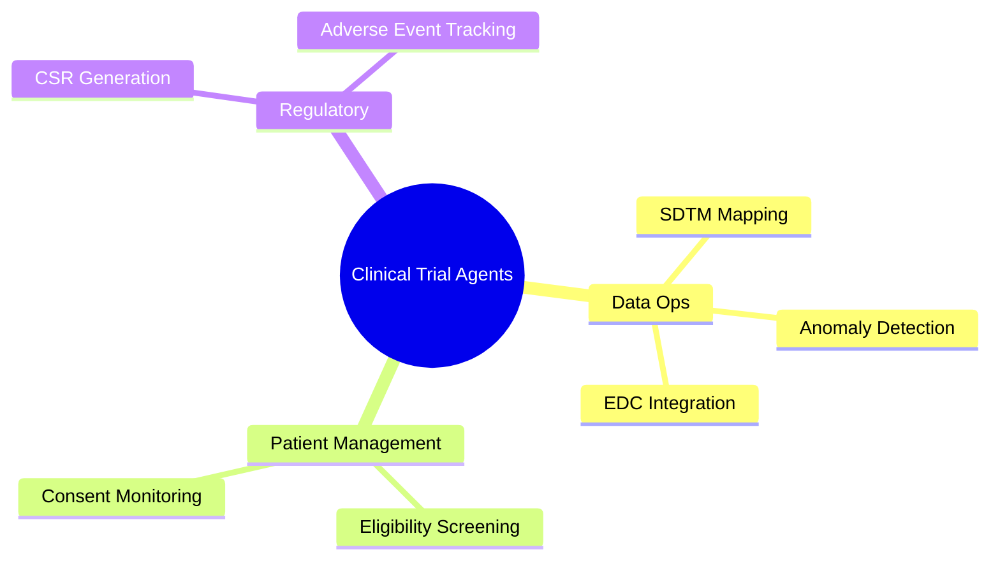
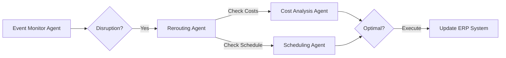
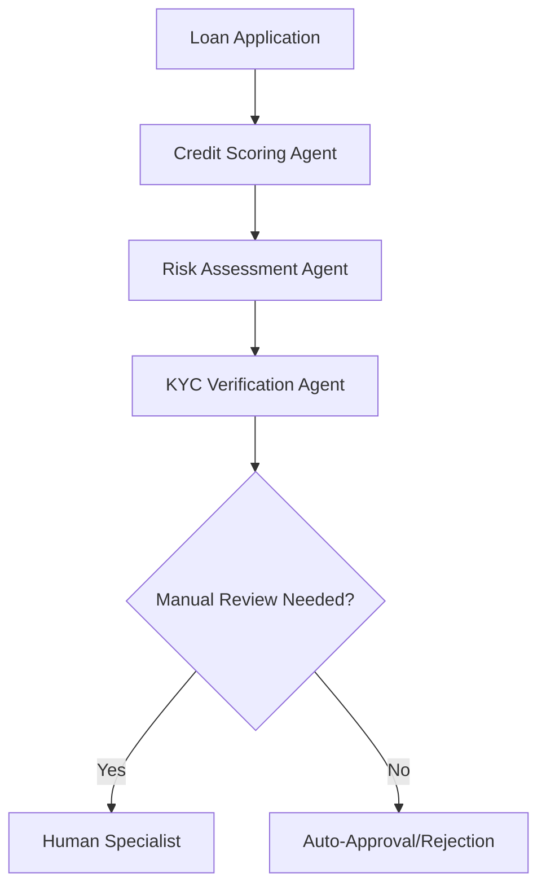
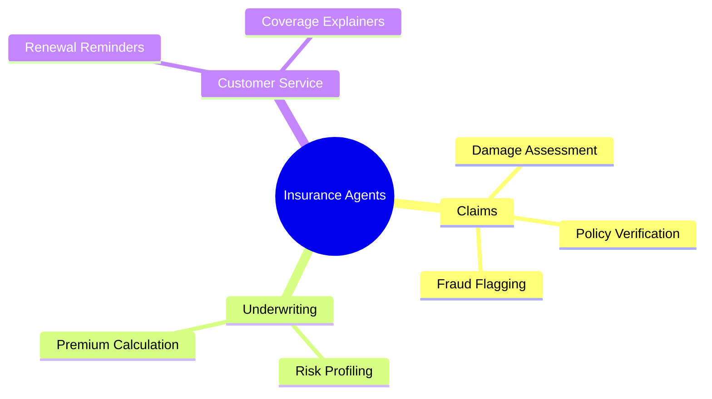

# Business Domains
This document explores how Agentic AI, powered by Python frameworks like LangGraph, CrewAI, and LangChain, transforms various business sectors through autonomous, goal-oriented workflows.

## Clinical Trials
Agentic systems in Clinical Trials streamline the path from drug discovery to regulatory approval.
* **Data Engineering & SDTM Mapping:** Agents can autonomously map raw clinical data to CDISC standards (SDTM/ADaM), identifying and fixing inconsistencies using local LLMs (Ollama) to maintain data privacy.
* **Automated Reporting:** Using RAG to synthesize Clinical Study Reports (CSR) from thousands of patient files.
* **Patient Recruitment & Management:** Multi-agent systems can screen patient eligibility against complex trial protocols using semantic search.

## Logistics Ocenaic and MultiModal
In logistics, agents handle the dynamic nature of global trade, managing disruptions autonomously.
* **Supply Chain Orchestration:** Agents monitor weather, port congestion, and geopolitical events to suggest alternative shipping routes.
* **Predictive Maintenance:** Analyzing sensor data from vessels and trucks to schedule repairs before failures occur.

## Power Regulation RTOs ISOs
Managing regional transmission organizations (RTOs) requires handling massive amounts of real-time data and regulatory compliance.
* **Compliance Audit Agents:** Using MCP (Model Context Protocol) to connect to internal document stores and verify grid operations against FERC/NERC regulations.
* **Load Forecasting:** Autonomous agents that adjust predictions based on micro-climatic changes and distributed energy resource (DER) inputs.

## Finance
Agentic development is revolutionizing financial services by moving beyond simple automation to cognitive decision-making.

### Wealth Management
* **Autonomous Portfolio Balancing:** Agents monitor market volatility and execute trades based on a user's risk profile without manual intervention.
* **Hyper-personalized Research:** Generating custom investment memos by scraping financial news (Tavily Search) and internal analyst reports.

### Banking
* **Agentic Fraud Detection:** Instead of static rules, agents investigate suspicious transactions by cross-referencing user history, location data, and social graphs.
* **KYC/AML Automation:** Agents process identity documents and perform background checks, escalating only ambiguous cases to humans.

### Brokerage & Trading
* **Algorithmic Agentic Trading:** Multi-agent teams where one agent analyzes sentiment, another technical indicators, and a third executes trades based on the consensus.

## Insurance
* **Claims Processing:** Agents can analyze photos of car accidents or property damage, cross-reference them with policy documents via RAG, and estimate payout amounts.
* **Underwriting:** Automating the risk assessment process for complex commercial insurance by synthesizing data from multiple external APIs and historical claims data.

## Image Processing
ML Engineer :Build features across Agentic, LLM and ML workflows including suggestion/rules components, search & retrieval, document extraction, and basic image/OCR processing. Translate problem statements into production-ready code, write clear documentation, and partner closely with MLOps for reliable releases. Should be aware of Model Drift & Data Drift practices.Roles and responsibilities:Write queries and extract data from structured/unstructured sources; implement parsing and normalization pipelines.Develop web/document extraction (Playwright/Selenium, Trafilatura; pypdf/pdfplumber/ocrmypdf) and convert to validated schemas.Implement prompts, tools/functions, and agent steps using LangChain; contribute to retrieval (BM25 + embeddings) and RAG modules.Add basic image processing with OpenCV and OCR using pytesseract where needed.Write clean, tested Python; add unit-style LLM tests with DeepEval; maintain experiment logs and evaluation datasets.Collaborate in Agile ceremonies; produce concise design notes and experiment reports.Technical experience & Professional attributes:Python with hands-on PyTorch; familiarity with deep-learning packages and the Hugging Face stack (transformers, datasets, SBERT).Web automation/scraping using Selenium or Playwright; robust HTML/text processing.Search basics and RAG patterns; vector stores and embeddings at a practical level.Image processing fundamentals (OpenCV) and OCR integration (pytesseract).Evaluation mindset:DeepEval for LLM outputs; Optuna/SHAP exposure is a plus.Preferred SkillsspaCy, scikit-learn; LightGBM/Flair where relevant.Experience with schema validation (pydantic/JSON Schema) and tokenization (tiktoken).Streamlit for internal demos (local-only).Education qualifications:Experience shipping ML/LLM features or strong applied projects demonstrating end-to-end ownership.Clear written/spoken communication and collaborative ways of working.You will be working with a Trusted Tax Technology Leader, committed to delivering reliable and innovative solutions