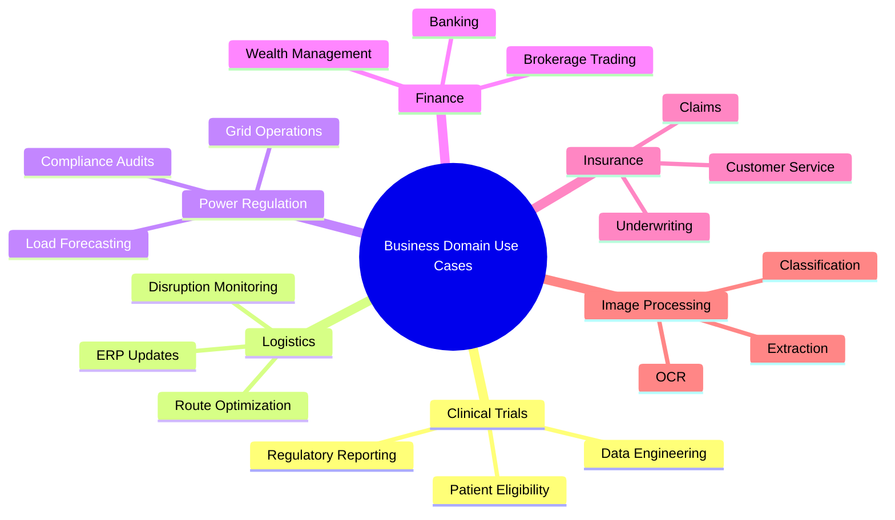
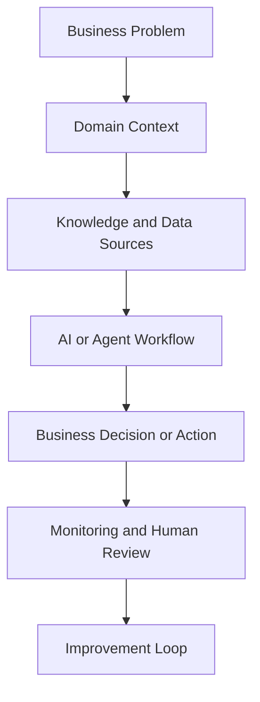

# 🏢 Business Domain Use Cases

## 🎯 Agentic AI by Industry and Operating Model

This section organizes business-domain examples into separate domain folders so each industry can grow into its own set of architecture notes, generators, and implementation code.

It is designed for:

- 👔 business leaders exploring AI value by industry
- 🧑‍💻 engineers planning domain-specific agent workflows
- 🧑‍🏫 trainers building examples for mixed-skill audiences
- 🧩 teams that want to add generators, prompts, and code over time

## 🗂️ Structure

- `domains/<domain>/README.md` for the domain overview
- `domains/<domain>/generators/README.md` for future code generators
- `domains/<domain>/code/README.md` for future implementations

## 🌐 Domain Map

## 🔄 Cross-Domain Delivery Flow

## 📚 Domain Index

1. 🧪 [Clinical Trials](domains/clinical-trials/README.md)
2. 🚢 [Logistics Oceanic and Multimodal](domains/logistics-oceanic-multimodal/README.md)
3. ⚡ [Power Regulation RTOs and ISOs](domains/power-regulation-rtos-isos/README.md)
4. 🏦 [Finance](domains/finance/README.md)
5. 🛡️ [Insurance](domains/insurance/README.md)
6. 🖼️ [Image Processing](domains/image-processing/README.md)

## 🧱 Common Building Blocks

- 🗃️ enterprise data stores and document repositories
- 🔎 retrieval and semantic search for grounded answers
- 🧠 LLM reasoning for summarization and planning
- 🛠️ tool calling for system actions and integrations
- 🧑‍⚖️ human approvals for high-risk decisions
- 📈 evaluation, audit logging, and operational monitoring

## 🚀 Next Expansion Points

Each domain folder is intentionally prepared for future additions:

- `generators/` for scaffolds, prompt templates, or workflow builders
- `code/` for reference implementations, APIs, notebooks, and demos

