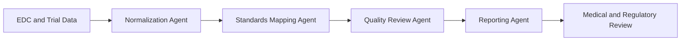
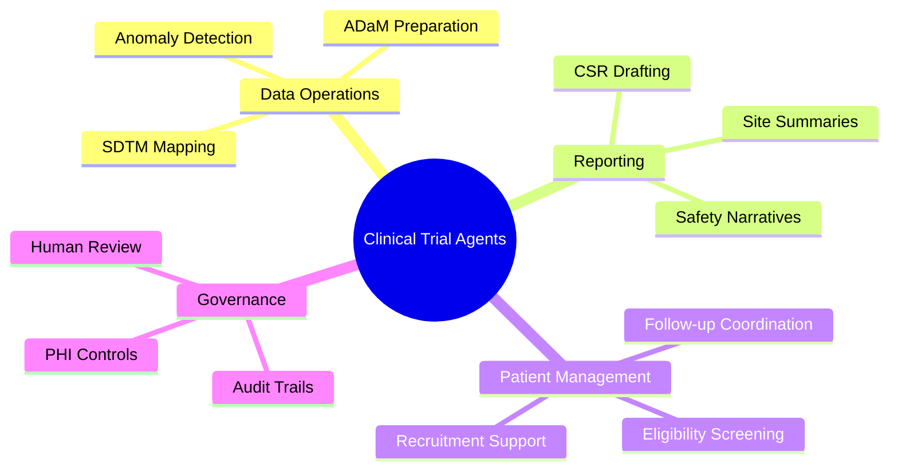

# 🧪 Clinical Trials

## 🧭 Why This Domain Matters

Clinical trial operations involve highly regulated workflows, large document volumes, sensitive data, and repeated handoffs across sponsors, sites, data teams, and regulators.

Agentic AI can help by:

- 🧬 organizing trial data pipelines
- 🧾 drafting regulatory and study documentation
- 👥 screening patient eligibility against protocols
- 🚨 surfacing anomalies for human review

## 💡 High-Value Use Cases

- 🗂️ SDTM and ADaM mapping support for trial data engineering
- 📄 Clinical Study Report drafting with retrieval-backed generation
- 🔍 protocol eligibility screening for recruitment support
- ⚠️ adverse event triage and follow-up coordination

## 🔄 Example Data Flow

## 🧠 Capability Map

## 🛡️ Domain Considerations

- 🔐 sensitive PHI and study data require tight access controls
- 🧑‍⚖️ final medical and regulatory sign-off should remain human-led
- 📜 outputs must align with CDISC and regulatory expectations

## 🧰 Domain Workspace

- 🧪 [Generators](generators/README.md)
- 💻 [Code](code/README.md)

