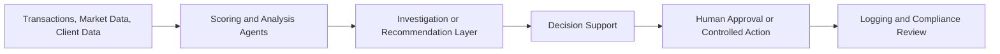
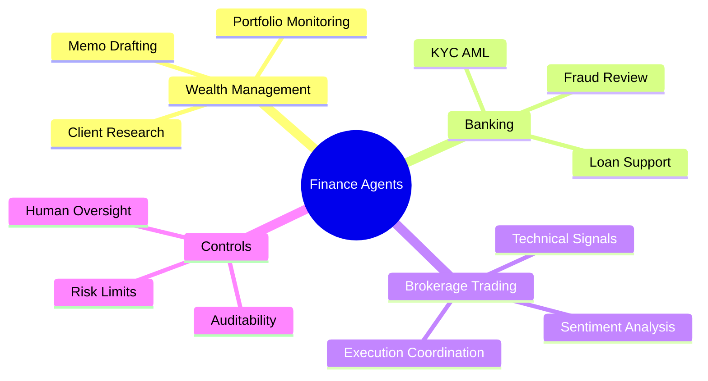

# 🏦 Finance

## 🧭 Why This Domain Matters

Finance combines high data volume, strict controls, frequent decisions, and strong expectations for traceability, fairness, and risk management.

This domain is split into focused subdomains so each area can evolve independently:

- 💼 [Wealth Management](wealth-management/README.md)
- 🏛️ [Banking](banking/README.md)
- 📈 [Brokerage and Trading](brokerage-trading/README.md)

## 💡 Cross-Finance Use Cases

- 📊 risk scoring and investigation support
- 🧾 research memo and client summary generation
- 🔍 KYC and AML evidence collection
- ⚖️ workflow escalation for high-risk decisions

## 🔄 Finance Operating Flow

## 🧠 Finance Mindmap

## 🧰 Domain Workspace

- 🏦 [Generators](generators/README.md)
- 💻 [Code](code/README.md)

