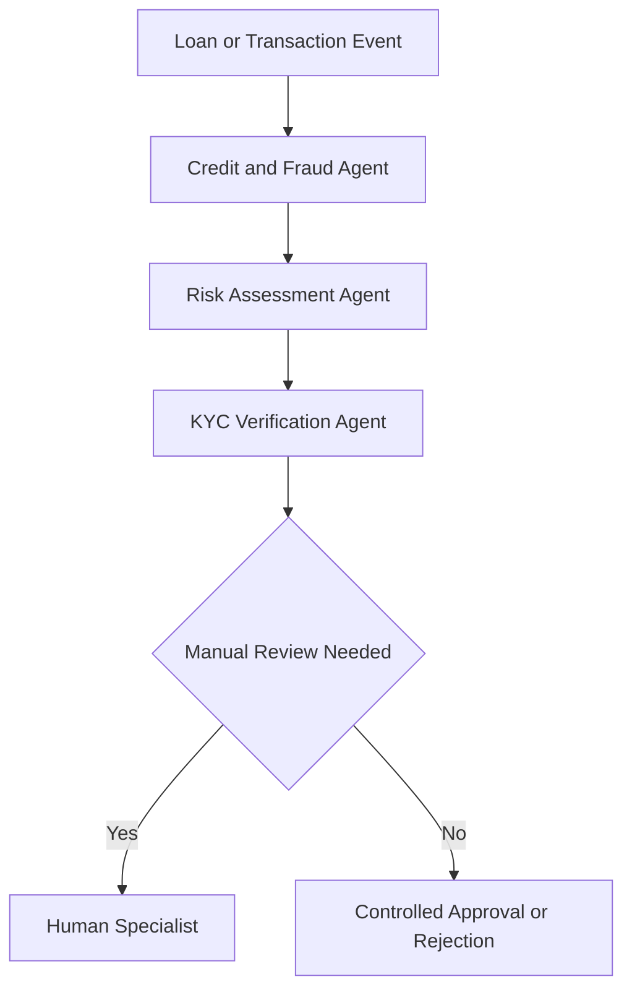
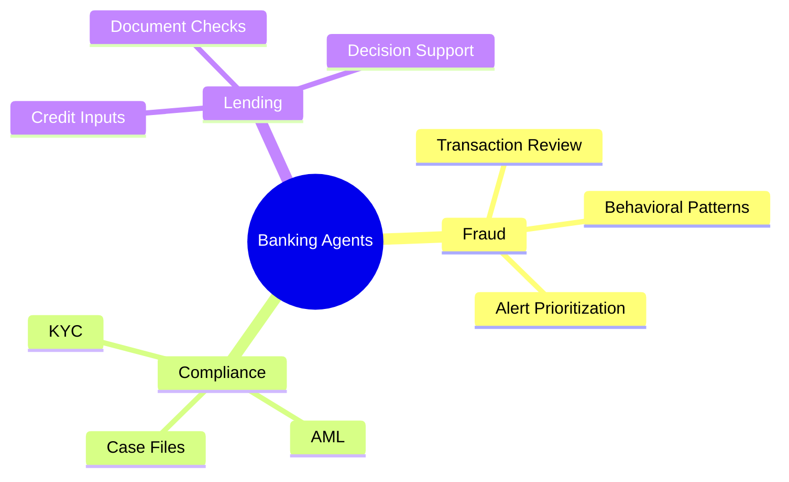

# 🏛️ Banking

## 🧭 Why This Subdomain Matters

Banking workflows require controlled investigation, identity verification, fraud monitoring, and strict escalation paths across customer, transaction, and compliance systems.

## 💡 High-Value Use Cases

- 🕵️ suspicious transaction investigation
- 🪪 KYC and AML workflow orchestration
- 🏦 loan review support and document validation
- 📣 exception routing to specialists

## 🔄 Example Data Flow

## 🧠 Capability Map

## 🧰 Workspace

- 🏛️ [Generators](generators/README.md)
- 💻 [Code](code/README.md)

