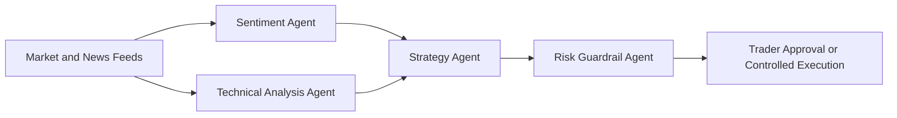
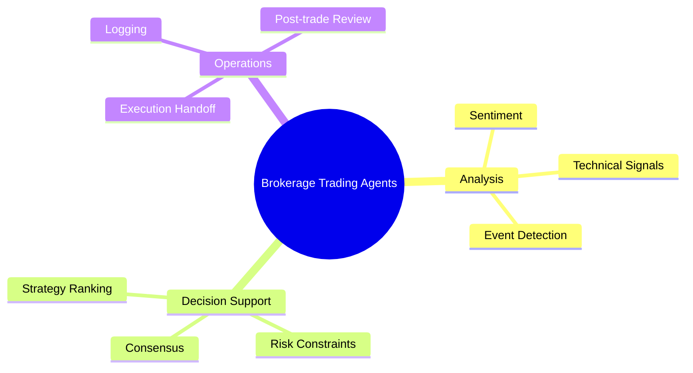

# 📈 Brokerage and Trading

## 🧭 Why This Subdomain Matters

Brokerage and trading environments depend on rapid analysis, coordinated signals, and strong controls around execution, monitoring, and exception handling.

## 💡 High-Value Use Cases

- 📰 sentiment and news analysis
- 📉 technical indicator monitoring
- 🤝 multi-agent consensus before trade suggestions
- 🧾 post-trade summaries and risk review

## 🔄 Example Data Flow

## 🧠 Capability Map

## 🧰 Workspace

- 📈 [Generators](generators/README.md)
- 💻 [Code](code/README.md)

