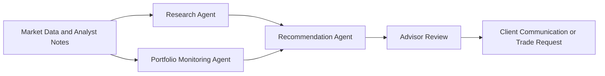
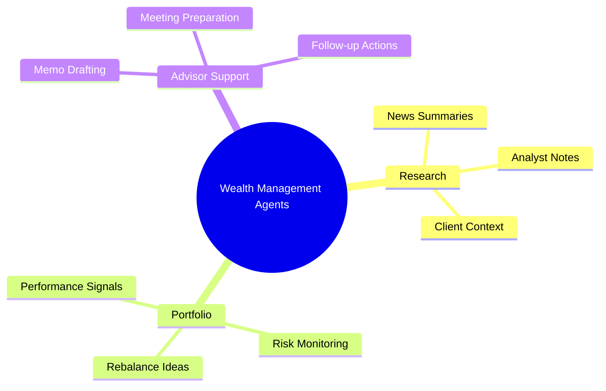

# 💼 Wealth Management

## 🧭 Why This Subdomain Matters

Wealth management teams need personalized insight, rapid research, and controlled portfolio actions without losing auditability or client trust.

## 💡 High-Value Use Cases

- 📈 portfolio monitoring and rebalance recommendations
- 📰 research synthesis from market news and internal notes
- 🧾 personalized investment memo drafting
- 👤 client profile-aware next-best-action support

## 🔄 Example Data Flow

## 🧠 Capability Map

## 🧰 Workspace

- 💼 [Generators](generators/README.md)
- 💻 [Code](code/README.md)

