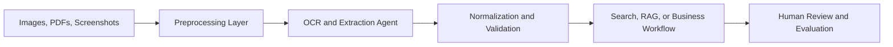
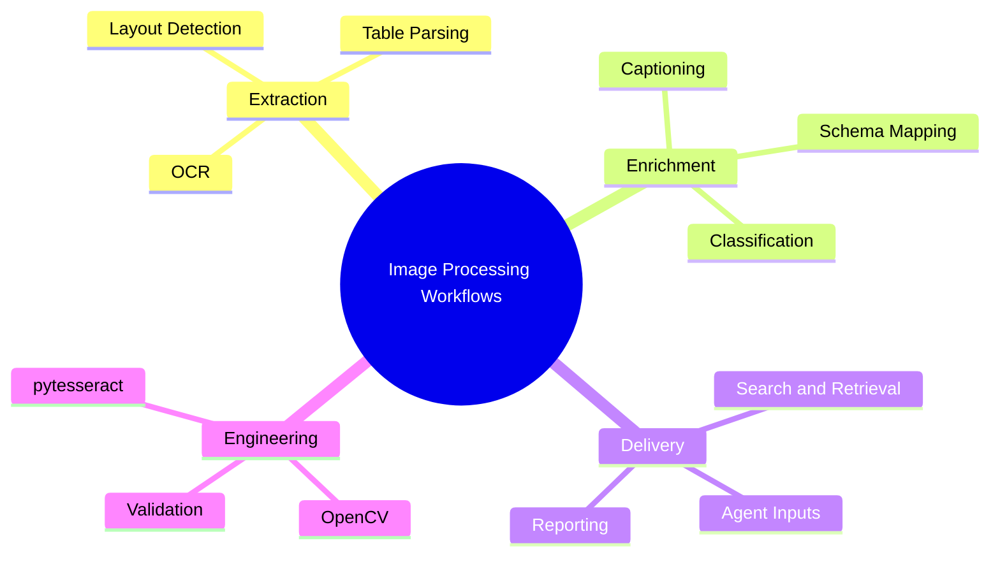

# 🖼️ Image Processing

## 🧭 Why This Domain Matters

Image processing supports many agentic and ML workflows by turning visual input into structured, searchable, and actionable information.

This domain is especially useful for:

- 🧾 OCR and document extraction
- 🔎 screenshot and image classification
- 🧹 preprocessing for downstream LLM or ML steps
- 🗂️ schema-ready transformation of visual content

## 💡 High-Value Use Cases

- 📄 OCR pipelines for scanned PDFs and forms
- 🏷️ image labeling and classification support
- 🧠 multimodal enrichment for RAG workflows
- 🧰 preprocessing for receipts, invoices, IDs, and screenshots

## 🔄 Example Data Flow

## 🧠 Capability Map

## 🛡️ Domain Considerations

- 📏 extraction quality varies by scan quality and layout complexity
- 🧪 evaluation datasets are important for drift and regression detection
- 🔐 documents may contain sensitive customer or regulated information

## 🧰 Domain Workspace

- 🖼️ [Generators](generators/README.md)
- 💻 [Code](code/README.md)

