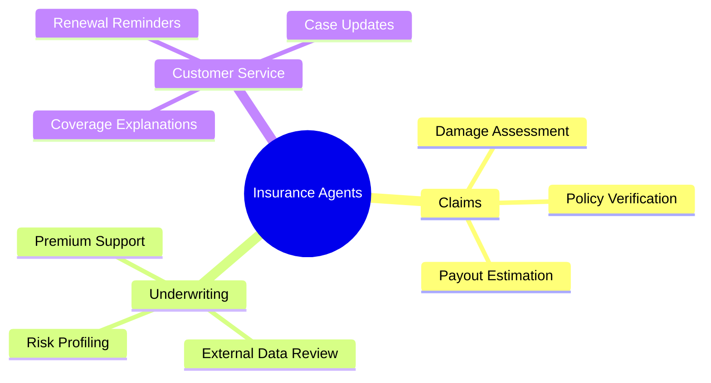

# 🛡️ Insurance

## 🧭 Why This Domain Matters

Insurance workflows require document-heavy reasoning, evidence gathering, fraud awareness, and clear underwriting or claims decisions backed by policy context.

Agentic AI can help by:

- 📸 interpreting damage evidence and claim documents
- 📚 grounding decisions in policy language
- 🧾 drafting customer-facing explanations
- ⚠️ escalating ambiguous or high-risk cases

## 💡 High-Value Use Cases

- 🚗 claims intake and damage assessment support
- 📄 policy verification and coverage explanation
- 🕵️ fraud signal review and prioritization
- 🧮 underwriting preparation and risk profiling

## 🔄 Example Data Flow

## 🧠 Capability Map

## 🛡️ Domain Considerations

- 🧑‍⚖️ final claim and underwriting decisions often require licensed review
- 🔐 customer data and evidence should remain protected
- 📜 outputs should remain explainable and traceable

## 🧰 Domain Workspace

- 🛡️ [Generators](generators/README.md)
- 💻 [Code](code/README.md)

