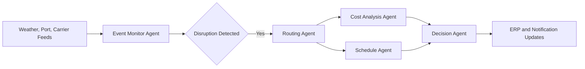
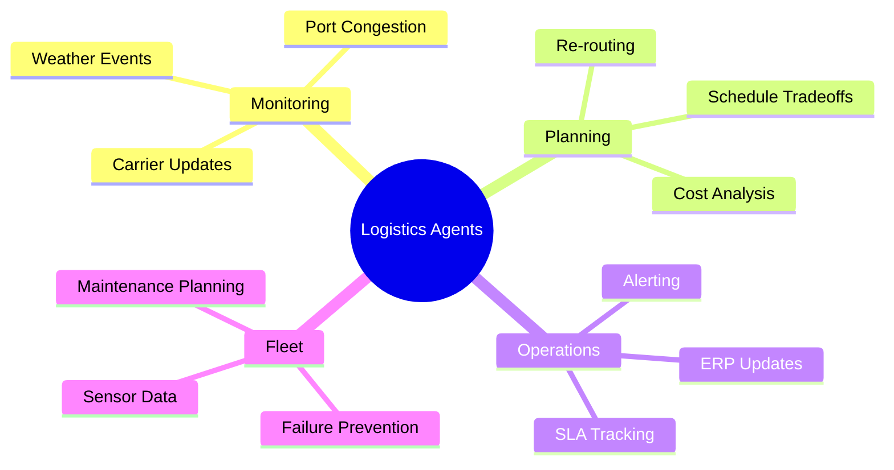

# 🚢 Logistics Oceanic and Multimodal

## 🧭 Why This Domain Matters

Global logistics depends on changing weather, port congestion, customs events, route economics, and multimodal coordination across sea, rail, truck, and warehouse operations.

Agentic AI can help by:

- 🌦️ monitoring disruptions continuously
- 🗺️ proposing alternative routes
- 💰 balancing service levels against cost
- 🔔 updating operations teams and backend systems

## 💡 High-Value Use Cases

- 🚨 disruption monitoring for ports, weather, and carriers
- 🛳️ route re-planning for oceanic and multimodal shipments
- 🔧 predictive maintenance for vessels, trucks, and equipment
- 📦 shipment exception summarization and action routing

## 🔄 Example Data Flow

## 🧠 Capability Map

## 🛡️ Domain Considerations

- ⏱️ decisions may be time-sensitive and operationally expensive
- 🔄 external feeds can be noisy or incomplete
- 🧑‍⚖️ large rerouting or contractual decisions should include human approval

## 🧰 Domain Workspace

- 🚢 [Generators](generators/README.md)
- 💻 [Code](code/README.md)

