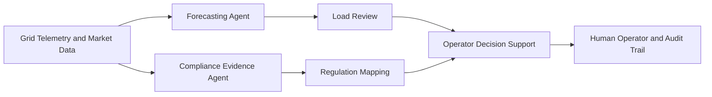
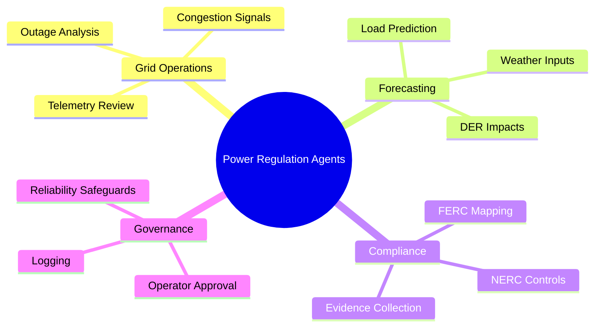

# ⚡ Power Regulation RTOs and ISOs

## 🧭 Why This Domain Matters

Regional transmission organizations and independent system operators manage grid reliability, market operations, and compliance across large networks with strict timing, safety, and regulatory requirements.

Agentic AI can help by:

- 📜 auditing rules and procedures against operating evidence
- 📈 improving load and congestion forecasting
- 🛰️ monitoring distributed energy and micro-climate impacts
- 🚨 flagging exceptions for operator review

## 💡 High-Value Use Cases

- 🧾 compliance audit support for FERC and NERC obligations
- 📊 adaptive load forecasting using local grid and weather signals
- 🔍 event investigation over operations logs and market data
- 🛠️ coordinated evidence gathering for regulatory response

## 🔄 Example Data Flow

## 🧠 Capability Map

## 🛡️ Domain Considerations

- 🛑 reliability and safety must outrank automation speed
- 🔐 system access should follow strict least-privilege patterns
- 🧑‍⚖️ market and grid actions require strong human accountability

## 🧰 Domain Workspace

- ⚡ [Generators](generators/README.md)
- 💻 [Code](code/README.md)

