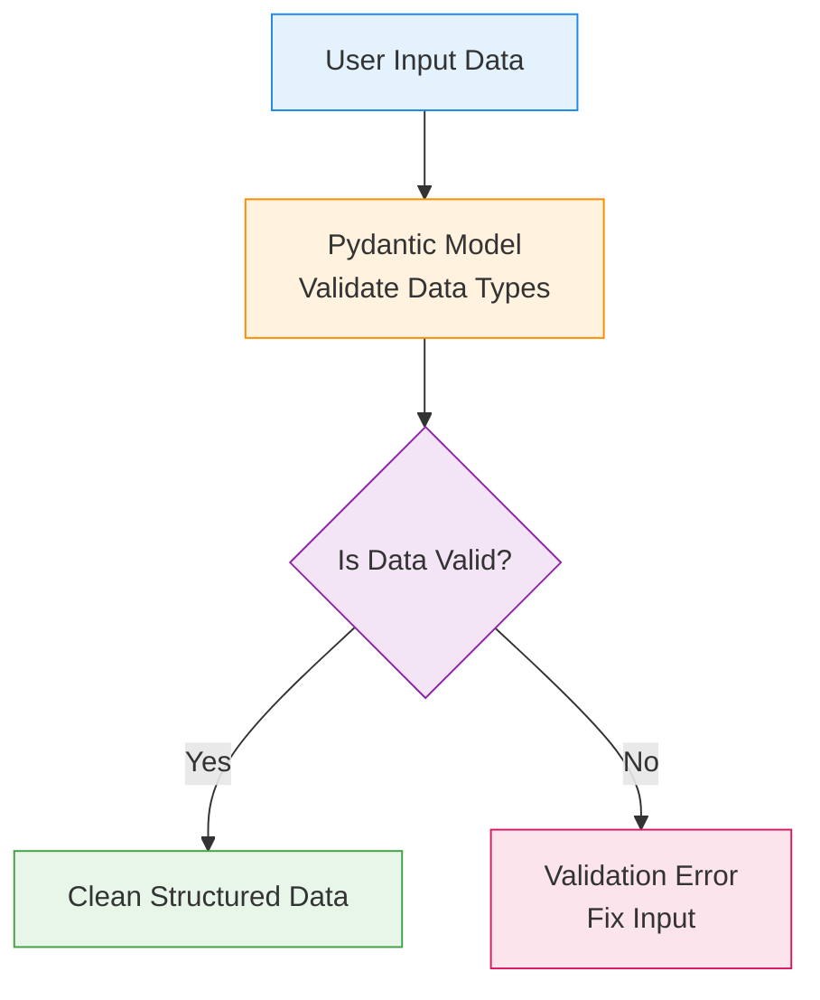
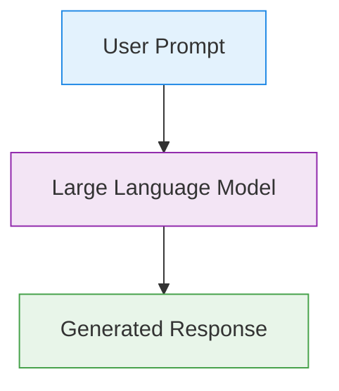
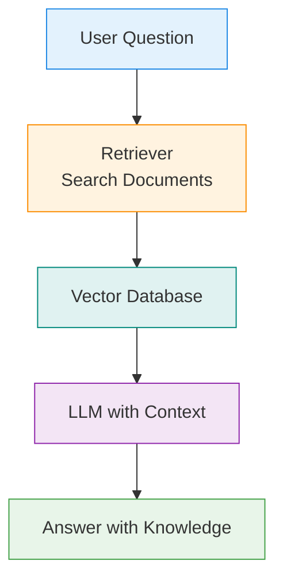
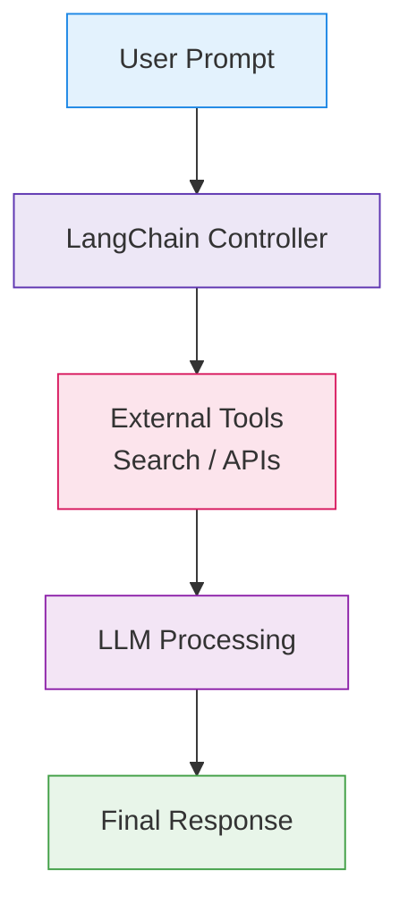
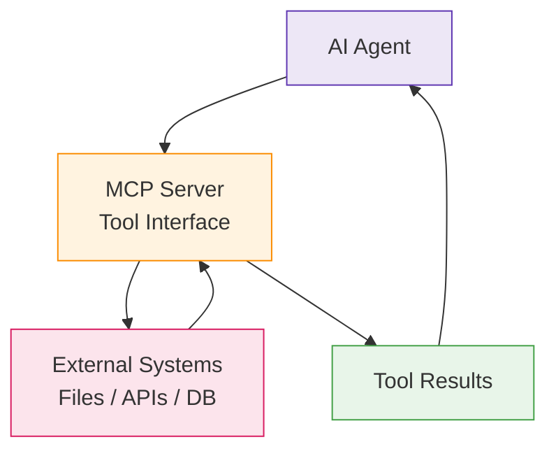
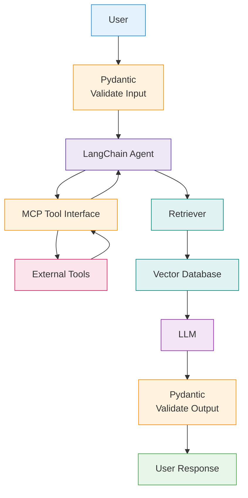

# Python Agentic Development
> (c) TINITIATE.COM / Venkata Bhattaram

This guide restructures the original material into a clearer **learning and implementation roadmap**, adds **installation steps**, and groups tools by real workflow stages.

---

# Table of Contents

1. What is Agentic Development
2. Core Agent Frameworks
3. Local Model Inference
4. Vector Databases (Memory)
5. Model Context Protocol (MCP)
6. RAG Patterns
7. Common Use Cases & Stacks
8. Recommended Learning Order
9. Consolidated Installation Guide


## Understanding the flow
* Practical real-world path to use a learning Order
* **Pydantic → Data validation**
  * Pydantic — Data Validation Workflow
  * Goal: Ensure data is correct before processing.


* **LLM basics → Prompt → Response**
  * LLM — Basic Language Model Workflow
  * Goal: Understand how an LLM processes prompts.

* **RAG → Add knowledge**
  * RAG — Retrieval-Augmented Generation
  * Goal: Add external knowledge to LLM.


* **LangChain → Add tools**
  * LangChain — Tool Orchestration Workflow
  * Goal: Connect LLM to tools.


* **MCP → Connect systems**
  * MCP — Tool Integration Workflow
  * Goal: Connect AI to external systems safely.


* **Full Agent Systems**
  * Combined System — Full AI Agent Architecture
  * This is the most important diagram.
  * Shows how everything works together.


---

# 1. What is Agentic Development

**Agentic development** is the design of systems where AI agents:

* Have goals
* Make decisions
* Use tools
* Maintain memory
* Retry tasks
* Collaborate with other agents

Unlike linear pipelines, agentic workflows support:

* Loops
* State transitions
* Self-correction
* Multi-agent collaboration

Typical Flow:

User → Agent → Tools → Memory → Decision → Output

---


## Core Agent Frameworks
These are the **most important libraries** in agentic systems.

---
### LangChain
**Role:** Foundation for building LLM-powered applications.

Provides:

* Prompt templates
* Chains
* Tool interfaces
* Document loaders
* Output parsers

**Installation:**

```bash
pip install langchain
```

Optional integrations:

```bash
pip install langchain-community
pip install langchain-openai
```

**Key Use Cases:**

* Build modular AI workflows
* Create tool-enabled pipelines
* Connect LLMs to data sources

---

### LangGraph
**Role:** Build stateful and looping agent workflows.

LangGraph adds:

* Cycles (loops)
* Multi-agent workflows
* State persistence
* Human-in-the-loop support

**Installation:**

```bash
pip install langgraph
```

**Best For:**

* Production agents
* Multi-step reasoning systems
* Retry workflows

---

### CrewAI

**Role:** Role-based multi-agent collaboration framework.

Agents behave like team members with roles.

**Installation:**

```bash
pip install crewai
```

**Best For:**

* Research agents
* Task delegation workflows
* Team-style AI coordination

---

## Local Model Inference

Running models locally improves:

* Privacy
* Cost efficiency
* Offline capability

---

### Ollama

**Role:** Run LLMs locally.

Examples:

* Llama 3
* Mistral
* Gemma

**Installation (System Level):**

Mac / Linux:

```bash
curl -fsSL https://ollama.com/install.sh | sh
```

Windows:

Download installer from:

[https://ollama.com](https://ollama.com)

**Pull Model:**

```bash
ollama pull llama3
```

**Python Integration:**

```bash
pip install langchain-ollama
```

---

## Vector Databases (Agent Memory)

Vector DBs store embeddings for retrieval.

Agents use them for:

* Memory
* Document search
* Knowledge retrieval

---

### ChromaDB (Local)

**Installation:**

```bash
pip install chromadb
```

**Best For:**

* Local development
* Lightweight RAG systems

---

### Qdrant

**Installation:**

```bash
pip install qdrant-client
```

Optional Docker deployment:

```bash
docker run -p 6333:6333 qdrant/qdrant
```

---

### Pinecone (Cloud)

**Installation:**

```bash
pip install pinecone
```

Requires API key setup.

---

### Weaviate (Cloud / Hybrid)

**Installation:**

```bash
pip install weaviate-client
```

---

## Model Context Protocol (MCP)

**Role:** Standard interface for connecting tools to agents.

Allows models to access:

* Files
* APIs
* Databases
* External systems

Without embedding logic inside prompts.

---

### MCP Python SDK

**Installation:**

```bash
pip install mcp
```

**Typical Uses:**

* File system access
* API integrations
* Tool standardization

---

## RAG (Retrieval-Augmented Generation)

RAG enables agents to retrieve relevant data before generating responses.

---

### Standard RAG

Flow:

User → Retriever → Context → LLM → Answer

---

### Self-RAG

Agent evaluates its own retrieved results.

If weak → retry retrieval.

---

### Corrective RAG (CRAG)

If retrieval fails:

Agent performs web search.

Used in:

* Research systems
* Support automation

---

## Common Use Cases & Suggested Stacks

| Use Case             | Suggested Stack            |
| -------------------- | -------------------------- |
| Autonomous Coding    | LangGraph + MCP + Ollama   |
| Market Research      | CrewAI + Tavily + ChromaDB |
| Document Audit       | LangChain + RAG + PyMuPDF  |
| Personal Assistant   | MCP + LangChain            |
| Multi-Agent Workflow | LangGraph + Vector DB      |
| Local Private Agent  | Ollama + ChromaDB          |

---

## Consolidated Installation Guide

To set up a complete Python environment for Agentic AI, follow these steps:

### 1. Environment Setup
```bash
python -m venv .venv
source .venv/bin/activate  # Mac/Linux: .venv/bin/activate | Windows: .venv\Scripts\activate
```

### 2. Core Orchestration & LLM Frameworks
```bash
pip install langchain langgraph crewai pydantic
pip install langchain-openai langchain-ollama langchain-community
```

### 3. Vector Databases (Local & Cloud)
```bash
pip install chromadb qdrant-client pinecone-client weaviate-client sentence-transformers
```

### 4. Tooling & MCP Integration
```bash
pip install mcp tavily-python PyMuPDF opencv-python pytesseract deepeval
```

### 5. Local Inference (Ollama)
1. Download from ollama.com.
2. Pull your first model:
   ```bash
   ollama pull llama3
   ```

---
## Recommended Learning Order (Very Important)

Follow this sequence for fastest mastery.

### Stage 1 — Foundations

Install:

```bash
pip install langchain
pip install chromadb
pip install ollama
```

Learn:

* Prompt templates
* Chains
* Basic RAG

---

### Stage 2 — Memory + Retrieval

Install:

```bash
pip install chromadb
pip install sentence-transformers
```

Learn:

* Embeddings
* Vector search
* Document ingestion

---

### Stage 3 — Agent Workflows

Install:

```bash
pip install langgraph
```

Learn:

* State machines
* Tool calling
* Retry loops

---

### Stage 4 — Multi-Agent Systems

Install:

```bash
pip install crewai
```

Learn:

* Role-based agents
* Collaboration workflows

---

### Stage 5 — Production Systems

Install:

```bash
pip install mcp
pip install pinecone
```

Learn:

* Tool protocols
* Distributed memory
* Deployment patterns

---

## Final Summary

A modern **Python agentic stack** typically includes:

* LangChain → workflow logic
* LangGraph → state machines
* Ollama → local models
* ChromaDB → memory
* MCP → tool integration
* CrewAI → multi-agent collaboration

Together, these components enable:

* Autonomous workflows
* Self-correcting systems
* Multi-agent collaboration
* Production-ready AI automation

---

## More To Dos
### If You Want Next-Level Improvement
* Full project template
* Production folder structure
* Docker setup
* CI/CD workflow
* Real-world RAG agent example
### Goals
* AI automation
* Data engineering agents
* Research agents
* Coding agents
* Personal assistant systems
